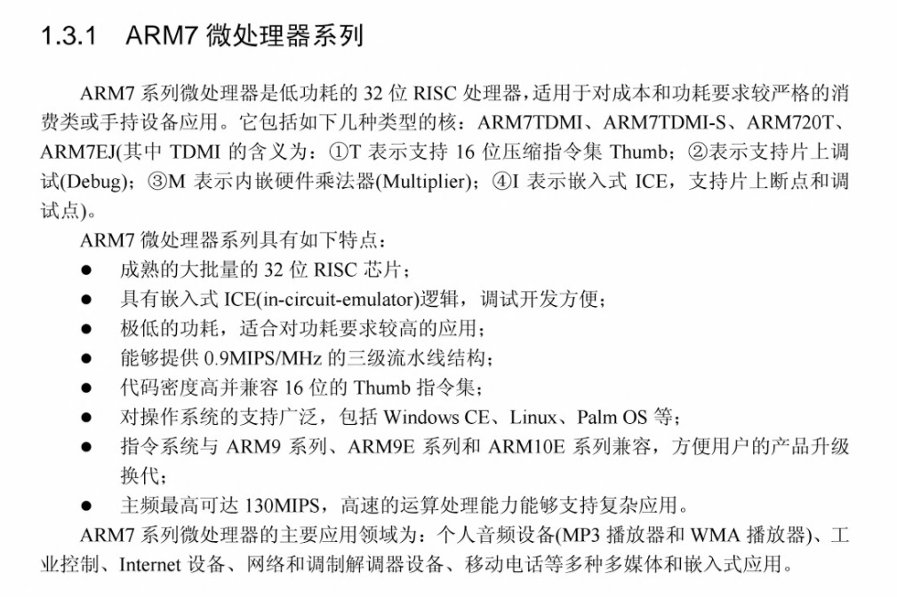

# ARMEJ-S 开发学习笔记

### 英文缩写含义
- CPSR：改变状态寄存器
- SP：堆栈指针

#### 7 种工作模式
- usr：用户模式
- fiq：快速中断模式
- irq：外部中断模式
- svc：管理模式
- abt：数据访问中止模式
- sys：系统模式
- und：未定义指令中止模式

### ARM7

### 程序状态寄存器
- CPSR（Current Program Status Register，当前状态寄存器）。

### 异常
- ARM 体系结构所支持的异常

